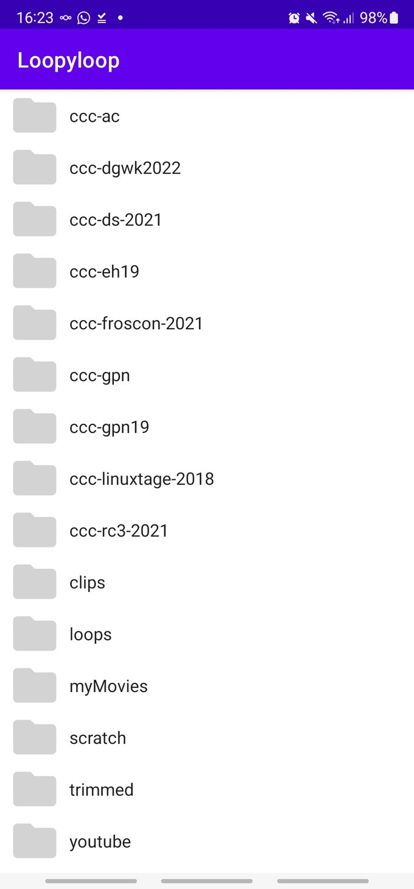
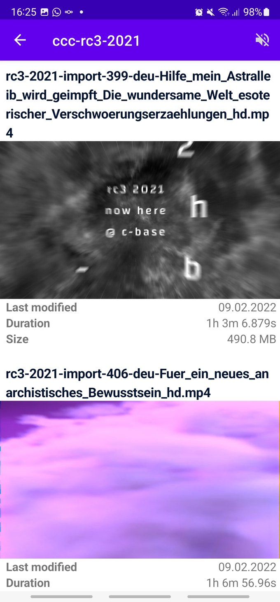

# Loopyloop

Android app playing local videos while scrolling.

Having a lot of small video clips the idea was to have an app to quickly scroll through the videos and watch the first couple of seconds.

Initially app displays list of directories containing videos. After choosing a directory thumbnails of the videos are displayed. The videos start playing while scrolling. The video may be opened in a separate view.

Written in Kotlin and using MediaStore, RecyclerView, ExoPlayer.

## App navigation

| Directory list | Video list | Video player |
| --- | --- | --- |
|  |  |  |
| directories containing videos | videos in a specific directory | single video in landscape mode

## References
- https://github.com/MostafaAnter/VideoPlayerInsideRecyclerView
- https://github.com/google/ExoPlayer

## Known bugs
The app is far from perfect - please see https://github.com/paddel10/Loopyloop/issues
